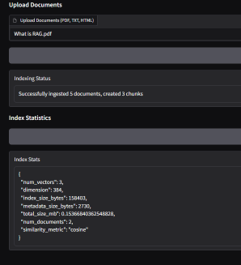
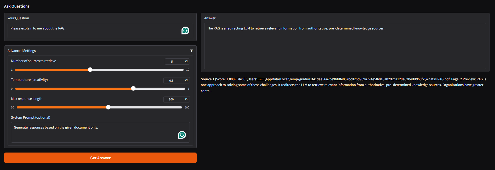

# RAG Document QA System

A production-ready Retrieval-Augmented Generation system for intelligent document question answering.

```
┌─────────────┐     ┌──────────────┐     ┌─────────────┐
│   Documents │────▶│   Ingestion  │────▶│   Chunker   │
│ (PDF/TXT)   │     │   Pipeline   │     │  & Splitter │
└─────────────┘     └──────────────┘     └─────────────┘
                                                 │
                                                 ▼
┌─────────────┐     ┌──────────────┐     ┌─────────────┐
│   Gradio    │◀────│   Generator  │◀────│  Embeddings │
│   Web UI    │     │   (LLM)      │     │   & Index   │
└─────────────┘     └──────────────┘     └─────────────┘
                           ▲                     ▲
                           │                     │
                    ┌──────────────┐     ┌─────────────┐
                    │   Retriever  │────▶│    FAISS    │
                    │ (Hybrid BM25)│     │  Vector DB  │
                    └──────────────┘     └─────────────┘
```

## Features

* **Multi-format document ingestion** : PDF, TXT, HTML
* **Hybrid retrieval** : Vector similarity (FAISS) + BM25 lexical search
* **Flexible LLM backends** : Local Hugging Face or OpenAI API
* **Production-ready** : Containerized, tested, CI/CD pipeline
* **Interactive UI** : Gradio-based web interface
* **Evaluation metrics** : Recall@k, answer similarity scoring

## Example

A document of RAG introduction is used. The content of the document is extracted from [aws](https://aws.amazon.com/what-is/retrieval-augmented-generation/).

Index document



Q/A:



## Quick Start

```bash
# Clone and setup
git clone https://github.com/yourusername/rag-doc-qa.git
cd rag-doc-qa
pip install -r requirements.txt

# Ingest sample documents
python -m rag_doc_qa.ingest examples/sample_docs/

# Build vector index
bash scripts/build_index.sh

# Run the web demo
bash scripts/run_demo.sh
# Navigate to http://localhost:7860
```

### Docker Quick Start

```bash
# Build and run with Docker
docker build -t rag-doc-qa .
docker run -p 7860:7860 -v $(pwd)/data:/app/data rag-doc-qa
```

## Installation

### Requirements

* Python 3.10+
* 2GB RAM minimum (4GB+ recommended)
* 1GB disk space for models and indices

### Environment Setup

Create a `.env` file:

```bash
# Model Configuration
EMBED_MODEL=sentence-transformers/all-MiniLM-L6-v2
LLM_BACKEND=hf  # Options: hf, openai

# Optional: OpenAI Configuration
OPENAI_API_KEY=your-key-here  # Only if LLM_BACKEND=openai
USE_OPENAI_EMBEDDING=false

# Performance Settings
CHUNK_SIZE=800
CHUNK_OVERLAP=200
TOP_K_RETRIEVAL=5
MAX_CONTEXT_LENGTH=3000

# Paths
INDEX_PATH=./data/faiss_index
METADATA_PATH=./data/metadata.json
CACHE_DIR=./data/cache
```

## Architecture & Design Decisions

### Chunking Strategy

* **Size** : 800 characters (optimal for semantic coherence)
* **Overlap** : 200 characters (preserves context boundaries)
* **Trade-off** : Smaller chunks = better precision, larger chunks = better context

### Model Choices

* **Embeddings** : all-MiniLM-L6-v2 (384 dims, 80MB, CPU-friendly)
* Alternative: OpenAI ada-002 (1536 dims, better quality, requires API)
* **LLM** : Flan-T5-base (248M params) for CPU, GPT-3.5 for API
* Trade-off: Local = privacy/cost, API = quality/speed

### Retrieval Strategy

* **Hybrid approach** : 70% vector similarity + 30% BM25 lexical
* **Benefits** : Handles both semantic and keyword queries
* **Latency** : <500ms for 10k documents on CPU

### Memory & Performance

* **Index size** : ~100MB per 100k chunks
* **Query latency** : 200-500ms (CPU), 50-100ms (GPU)
* **Ingestion speed** : ~10 docs/second (PDF), ~50 docs/second (TXT)

## Evaluation

Run evaluation suite:

```bash
python -m rag_doc_qa.evaluate \
  --dataset examples/eval_dataset.json \
  --output reports/evaluation.md
```

Metrics:

* **Recall@k** : Measures retrieval quality
* **Answer Similarity** : BERTScore/cosine similarity
* **Latency** : End-to-end response time

## Customization

### Switching to GPU

Install CUDA version of PyTorch:

```bash
pip install torch==2.8.0+cu128 --index-url https://download.pytorch.org/whl/cu128
pip install faiss-gpu==1.7.2
```

Update your configuration:

```python
# In config.py
DEVICE = "cuda" if torch.cuda.is_available() else "cpu"

# For larger models, update .env:
EMBED_MODEL=BAAI/bge-large-en-v1.5
```

### Using Cloud LLMs

```bash
# .env
LLM_BACKEND=openai
OPENAI_API_KEY=sk-...
```

### Scaling to Production

1. **Replace FAISS** : Use Milvus/Weaviate for distributed indexing
2. **Add caching** : Redis for embeddings cache
3. **Horizontal scaling** : Deploy retriever/generator as microservices
4. **Monitoring** : Add Prometheus metrics + Grafana dashboards

## API Examples

### Python SDK

```python
from rag_doc_qa import RAGPipeline

rag = RAGPipeline()
rag.ingest_documents(["document.pdf"])
answer = rag.query("What is the main topic?")
print(answer.text, answer.sources)
```

### REST API (via Gradio)

```bash
curl -X POST http://localhost:7860/api/query \
  -H "Content-Type: application/json" \
  -d '{"question": "What is RAG?", "top_k": 5}'
```

## Development

```bash
# Install dev dependencies
pip install -e ".[dev]"

# Run tests
pytest tests/ -v --cov=rag_doc_qa

# Format code
black src/ tests/
isort src/ tests/

# Lint
flake8 src/ tests/
```

## Contributing

Contributions welcome! Please ensure:

* All tests pass
* Code is formatted with Black
* Type hints are used
* Documentation is updated

## License

MIT License - see LICENSE file

## Acknowledgments

Built with:

* [Hugging Face Transformers](https://huggingface.co/transformers)
* [FAISS](https://github.com/facebookresearch/faiss)
* [Gradio](https://gradio.app/)
* [LangChain](https://langchain.com/) (inspiration)

## Future Improvements

* [ ] Add conversation memory for multi-turn QA
* [ ] Implement document update/deletion in index
* [ ] Add authentication for web UI
* [ ] Support for tables and images in PDFs
* [ ] Streaming responses for better UX
* [ ] A/B testing framework for retrieval strategies
  ==================================================

# rag-doc-qa

Retrieval-Augmented Generation (RAG) Document QA System
